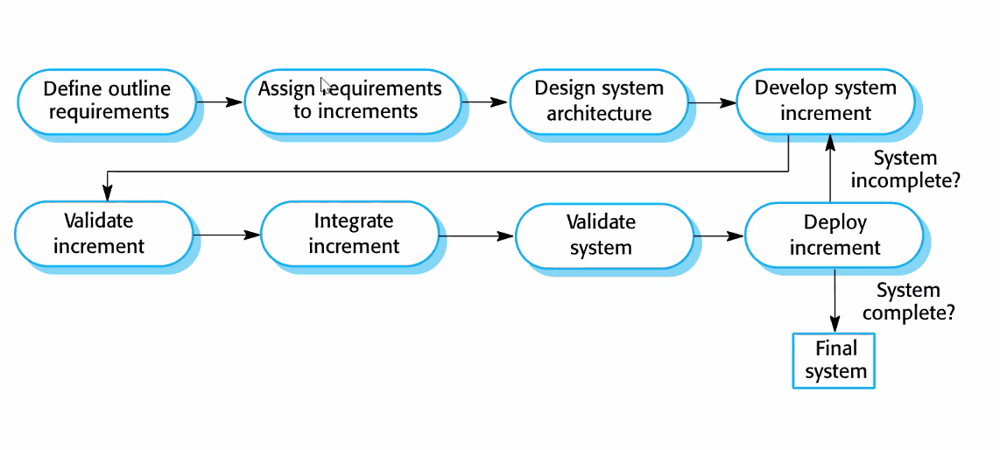
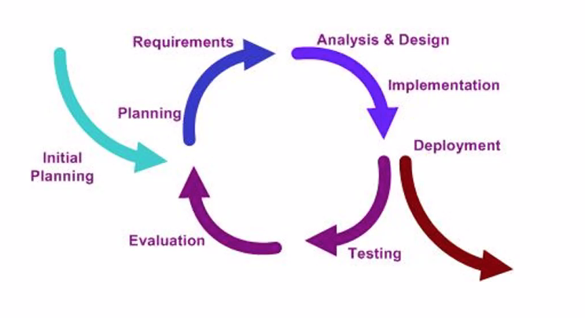
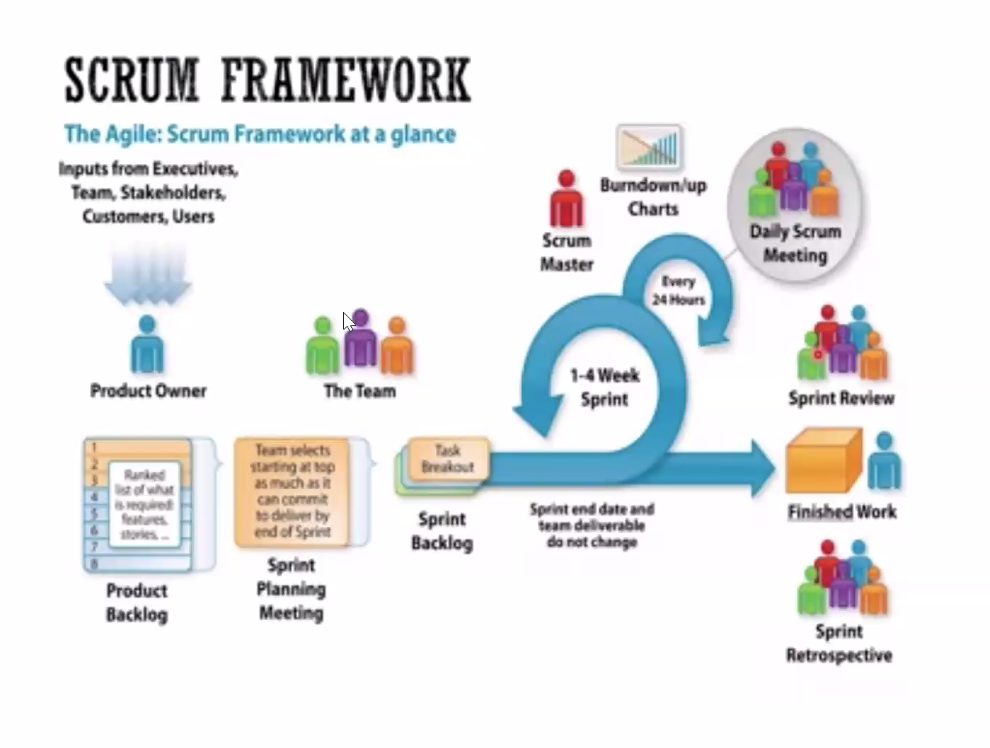

# Software Development Process

The process of developing software is generally broken down into the following phases:

- - **Specification** (or **Requirements Engineering**) - defining what the system should do
  - **Design** **and** **implementation** - defining the org
  - **Validation** - checking that it does what the customer wants
  - **Evolution** - changing in response to customer needs

 

### Requirements engineering 

- - Generally the first step
  - Process of understanding and defining what services are required and identifying the constraints on these services
  - Ensures software will meet the user expectations
  - Cost of correcting requirements errors increases **exponentially** across development cycle, so it pays off to have well defined requirements

 

### Software design and implementation

- - Design

  - - Description of structure

  - Implementation

 

### Software verification and validation

- - More general than just testing

  - - Testing: executing the system using a set of test cases with the intent of finding and removing       bugs

 

### Software evolution

- - 4 types of maintenance

  - - **Corrective**: Fixing errors
    - **Adaptive**: Changing for new environment (ex. New OS)
    - **Perfective**: Adding new functionality
    - **Preventive**: Preventing errors

# Types of Processes

- - **Plan driven**

  - - Activities planned in advance and progress is measured against plan

  - **Agile**

  - - Planning is incremental and iterative, easier to change the process to reflect changing requirements

  - **Process models**

  - - **Waterfall**

    - Incremental dev

    - Iterative dev

    - **Agile** dev

    - Reuse-oriented dev

    - Prototyping

    - Spiral model

    - Formal transformation

      

- ### Waterfall Model

- 

- - **Main drawback**:

  - - Difficulty of accommodating change once the process is underway

  - More problems

  - - Inflexible partitioning of the project
    - Mostly used for large systems

  - In principle, phases must be completed sequentially

### Incremental Model

- Cost of accommodating changing requirements is reduced

- Easier to get feedback

- Rapid development

- Early increments act as prototype

- Lower risk of overall project failure

- Highest priority system services tend to receive the most testing

- Problems

- - Process is not visible
  - Structure tends to degrade as new increments are added
  - Problematic when new system is intended to replace an existing system

## Coping with change

- - Change is inevitable

  - - Business change

  - **Change anticipation**

  - - Process includes activities that can anticipate possible changes before significant rework is       required

  - **Change tolerance**

  - - Where the process is designed for changes to be accommodated at relatively low cost

  - Two ways of coping:

  - - System **prototyping**

    - - A version of the system is developed quickly to check the requirements and feasibility of design decisions - supports change anticipation

    - **Incremental delivery**

    - - System increments are delivered to the customer incrementally - supports change tolerance

### Prototyping Model

- - Prototype: an initial version of a system used to demonstrate concepts and try out design options

  - Can be used in:

  - - The requirements engineering process
    - In design process - explore options
    - In testing process - run back to back tests

  - **Benefits**

  - - Improve system usability
    - Closer match to users needs
    - Improved design quality
    - Improved maintainability
    - Reduced development effort

  - May be based on rapid prototyping tools

  - May have to remove features for speed's sake

### Iterative Development

### Agile Development

- - System is developed through small, frequent, incremental releases

  - Requirements include relatively simple customer stories, easy to modify

  - Complete requirements document not usually created

  - Customers are continuously engaged, and their representatives

  - Agile manifesto (2001)

  - - We value

    - - **Individuals and interactions** over processes and tools
      - **Working software** over comprehensive documentation
      - **Customer collaboration **over contract negotiation
      - **Responding to change** over following a plan

  - More methodologies:

  - - Scrum
    - Kanban
    - Extreme programming  (xp)
    - Dsdm - dynamic system development method

### Scrum methodology

- - Scrum roles

  - - **Product owner**
    - **Dev team**
    - **Scrum master**

  - Product requirements are referred to as product backlog - includes features, bug fixes,      requirements, etc.

  - Requirements are represented as user stories

    

