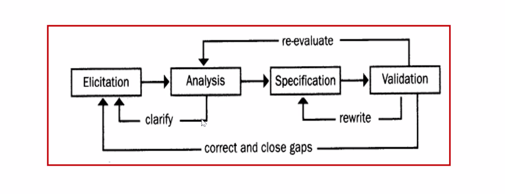

# Requirements Elicitation and User Stories

### Software development process

There are many different types of methods, but they all include the following sub-processes:

- specification
- design/implementation
- verification
- validation
- evolution

### Software lifecycle

- **Requirements elicitation**
- analysis
- system design
- detailed design
- implementation
- testing

## Requirements Development Process

## User stories

**A user story is a short, simple description of a feature told from the perspective of the person who desires the new capability, usually a user or customer.**

- often used in agile processes
- focuses on what the user **wants to have**, not what the user **wants the system to do**
- often recorded on a flash card or note
- a set of user stories defines *system requirements*

Usually a user story follows a simple template:

**As a {type of user},**

**I want to {perform some task}**

**so that I can {achieve some goal/benefit/value}.**

For example:

- As a user, I want to sign in to the site from a login page so that I can be authenticated.
- As a student, I want to purchase a parking permit so that I can drive to school.

### Three C's of user stories

- **card**: the main intention is to describe the user story in short form to allow *common understanding* of the users needs among all stakeholders.

- **conversation**: user stories shift the focus from writing about features to *discussing* them. These discussions are more important than whatever text is written.

- **confirmation**: *acceptance tests* confirm that the story was delivered correctly.

  

### Details as conditions of satisfaction

Here's a simple user story that has a couple conditions in order to satisfy it.

- as a user, i can cancel a reservation
  - verify that a premium member can cancel the same day without a fee
  - verify that a non premium member is charged 10%
  - verify that an email confirmation is sent
  - etc.

**Instead of having many conditions, write smaller sub-stories**

- as a premium site member, i can cancel a reservation any time for free
- as a non-premium member, i can cancel with a 10% fee
- as a site visitor, i am emailed a confirmation

### Acceptance criteria

Usually a user story is accompanied by confirmation criteria. **Acceptance criteria is the detail required to know when a ticket meets its definition of done.** These are not solution specific, but they can detail requirements that need to be hit.

**Here's a quick example:**

*As a customer, I want to withdraw cash from an ATM so that I don't have to wait in line at the bank.*

<u>Acceptance criterion 1:</u>

- **Given** that the account is creditworthy, and the card is valid, and the dispenser contains cash,
- **When** the customer requests cash,
- **Then** ensure the account is debited, and cash is dispensed, and the card is returned.

### Examples of bad and good user stories

**bad:**

- as a user, i want a password so that i can keep my account secure

**good:**

- as a user, i want a way to access my previously used details so that i don't have to repeatedly enter my details to shop with you.

**A user story is not about dictating what the solution is, its about posing the problem for the user that needs solving.**

### User Story Terms

- **Theme**: a collection of related user stories
- **Epic**: A large user story

- **Scenario**: 