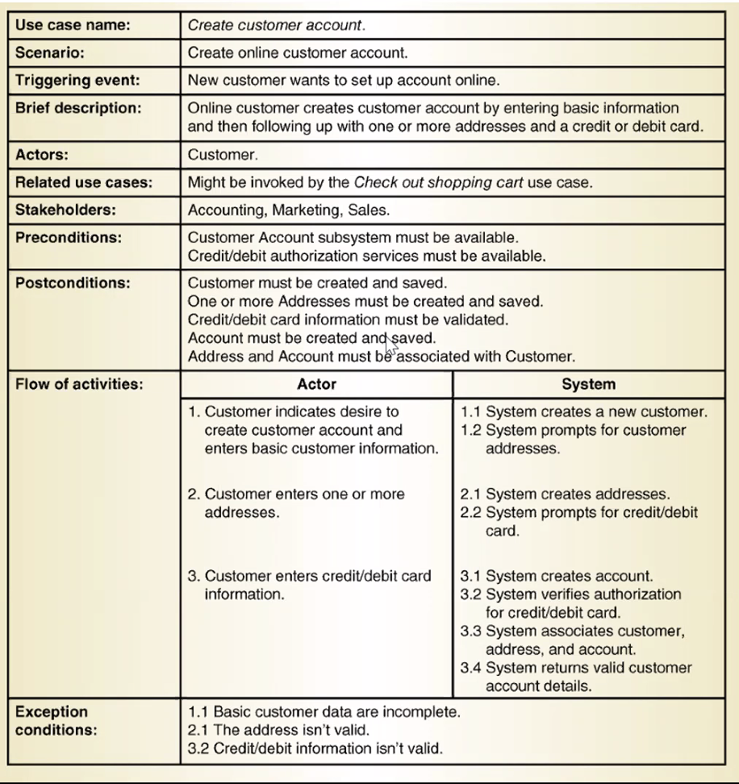

# Requirements Elicitation and User Stories

### Software development process

There are many different types of methods, but they all include the following sub-processes:

- specification
- design/implementation
- verification
- validation
- evolution

### Software lifecycle

- **Requirements elicitation**
- analysis
- system design
- detailed design
- implementation
- testing

## Requirements Development Process

### Types of Requirements

- **functional requirements**
  - describe interaction between system and environment independent from the implementation
    - "an operator must be able to define a new game"
- **nonfunctional requirements**
  - aspects not directly related to functional behavior
    - "response time must be less than 1 sec"
  - types:
    - usability
    - reliability
    - performance
      - response time
    - supportability
      - adaptability
      - maintainability
      - modifiability
- **constraints**
  - imposed by client or environment
    - "the implementation language must be X"

## User stories

**A user story is a short, simple description of a feature told from the perspective of the person who desires the new capability, usually a user or customer.**

- often used in agile processes
- focuses on what the user **wants to have**, not what the user **wants the system to do**
- often recorded on a flash card or note
- a set of user stories defines *system requirements*

Usually a user story follows a simple template:

**As a {type of user},**

**I want to {perform some task}**

**so that I can {achieve some goal/benefit/value}.**

For example:

- As a user, I want to sign in to the site from a login page so that I can be authenticated.
- As a student, I want to purchase a parking permit so that I can drive to school.

### Three C's of user stories

- **card**: the main intention is to describe the user story in short form to allow *common understanding* of the users needs among all stakeholders.

- **conversation**: user stories shift the focus from writing about features to *discussing* them. These discussions are more important than whatever text is written.

- **confirmation**: *acceptance tests* confirm that the story was delivered correctly.

### Tecniques to elicit requirements

- **interview**: formal or informal with stakeholders
- **task analysis:** observing end users in their operational environment
- **user storires:** short descriptions of features from the perspective of users
- **scenarios:** describe the use of the system as a series of interactions between a concrete end user and the system
- **use cases:** abstractions that describe a class of scenarios

### Requirements Validation

- **correctness**
  - the requriements represents the client's view
- **completeness**
  - all possible scenarios in which the system can be used are described
- **consistency**
  - no requirments conflict
- **clarity**
  - requirements can only be interpreted in one way
- **realism**
  - requiements can be implemented and delivered
- **traceability**
  - each system behavior can be traced to a set of functional requirements
- **verifiability**
  - should be written so that it can be tested

### Details as conditions of satisfaction

Here's a simple user story that has a couple conditions in order to satisfy it.

- as a user, i can cancel a reservation
  - verify that a premium member can cancel the same day without a fee
  - verify that a non premium member is charged 10%
  - verify that an email confirmation is sent
  - etc.

**Instead of having many conditions, write smaller sub-stories**

- as a premium site member, i can cancel a reservation any time for free
- as a non-premium member, i can cancel with a 10% fee
- as a site visitor, i am emailed a confirmation

### Acceptance criteria

Usually a user story is accompanied by confirmation criteria. **Acceptance criteria is the detail required to know when a ticket meets its definition of done.** These are not solution specific, but they can detail requirements that need to be hit.

**Here's a quick example:**

*As a customer, I want to withdraw cash from an ATM so that I don't have to wait in line at the bank.*

<u>Acceptance criterion 1:</u>

- **Given** that the account is creditworthy, and the card is valid, and the dispenser contains cash,
- **When** the customer requests cash,
- **Then** ensure the account is debited, and cash is dispensed, and the card is returned.

### Examples of bad and good user stories

**bad:**

- as a user, i want a password so that i can keep my account secure

**good:**

- as a user, i want a way to access my previously used details so that i don't have to repeatedly enter my details to shop with you.

**A user story is not about dictating what the solution is, its about posing the problem for the user that needs solving.**

### User Story Terms

- **Theme**: a collection of related user stories
- **Epic**: A large user story
- **Scenario**: a concrete, focused, informal **description of a single feature of the system used by a single actor**

#### Scenario

- tool to illustrate one possible use of an existing or proposed system
- can include text, vid, pics, or story boards

Scenario example:

- Jim withdraws 100 from his checking account
  - 1. jim presses withdraw
    2. system displays the screen
    3. jim presses digit buttons 1, 0, 0
    4. system displays the screen with jim's checking and savings accounts
    5. etc...

#### Scenario based design

	- **requirements elicitation:** as-is scenario, visionary scenario
	- **client acceptance test:** evaluation scenario
	- **System deployment:** training scenario

#### Use cases and scenarios

- A **use case** is a definition of a goal oriented set of interactions webtween actors and system
- an **actor** is a party outside the system that interacts with it
- UC is initiated by an actor
- a **scenario** is an instance of a use case, and represents a single path through the use case

### Actors

- an actor may be a class of users
- a **primary** actor has a goal requiring the assistance of the system and initates a use case
- a **secondary** actor is one from which the system needs assistance
- actors can be used in user stories

### Use Case Description

- **basic sequence** of interactions between actors and system
- may include **variants** of the sequence
- may include **exceptions**
- system is treated as a black box, and interactions with the system, including system responses, are percieved from outside the system

#### How to find use cases

- select a narrow vertical slice of the system (one scenario)

- select a horizontal slice (many scenarios) to devine scope
- use mockups as visual support
- find out what the user does
  - task observation >>> questionaires

## UML Use Case Diagrams

### Actors

- abstraction of an external entity

### Use case associations

- types
  - includes
  - extends
  - generalization

Use cases can be related:

- **includes relationship**
  - to represent functional behavior common to more than one use case
- **extends relationship**
  - to represent seldom invoked use case fragments or exceptional functionality
  - an extension is typically not a complete use case

if a use case is **necessary** in the process of another, it's an includes relationship. 

- Example: Create Account --> invoke Send Verificaiton Email (Create Account cannot finish unless Send Verification Email is called)

If a use case is optional or only sometimes included in another's process, it's an extends relationship.

- example: checkout --> invoke PayPal (chould be more than one payment option)

  

### Include: functional decomposition

- problem
  - a function in the original problem statement is too complex
- solution
  - describe the function as the aggregation of a set of simpler functions. the associated use case is decomposed into shorter use cases

### Include: reuse of existing functionality

- problem
  - theere may be overlaps among use cases
- solution
  - see slides

**Important note: don't draw sequence of actions in use case diagrams**

Another important note: preconditions are not an **include** relationship

caller --> request ambulance -->

operator --> enter info from caller, or 

--extends-->enter info from gps